# dental-clinic-session-app (HttpSession Version)
*This is a secure web application built with Java and Springboot for managing a dental clinic: appointments, patients, and staff. In this version, I use server-side state management with HttpSession,  I am going to develop a JWT version soon!*

# Logged Out Unregistered Preview
*Patients can check the available appointment slots in the schedule, before signing in*

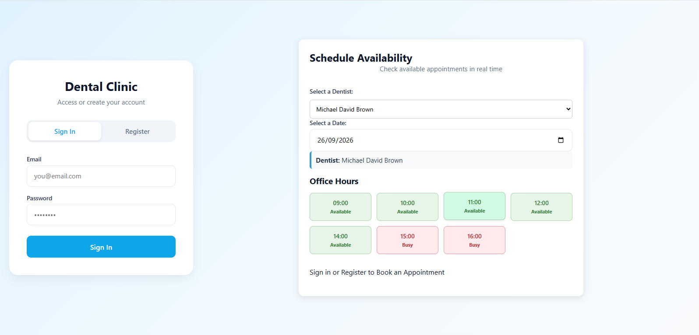

*The date can be changed to find an available date*

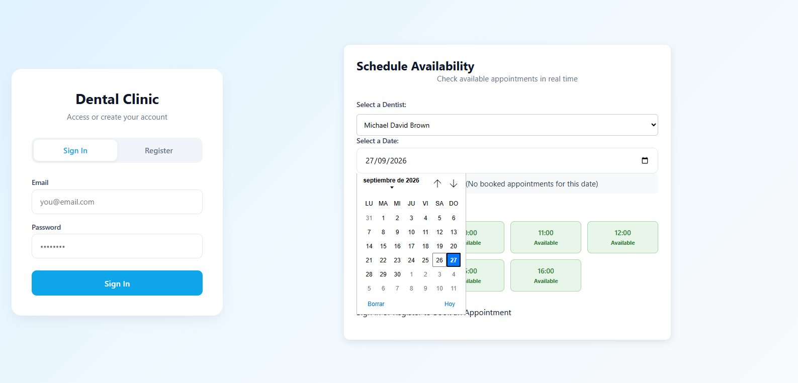

*The Doctor can also be changed to find available slots if they are occupied*

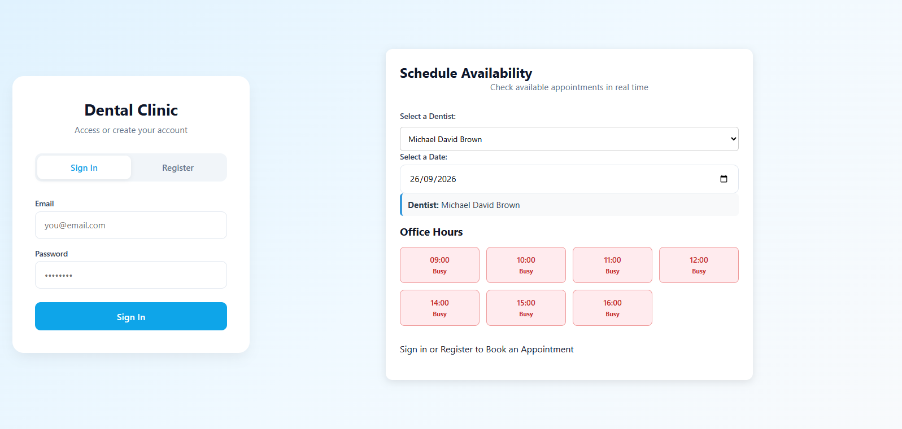
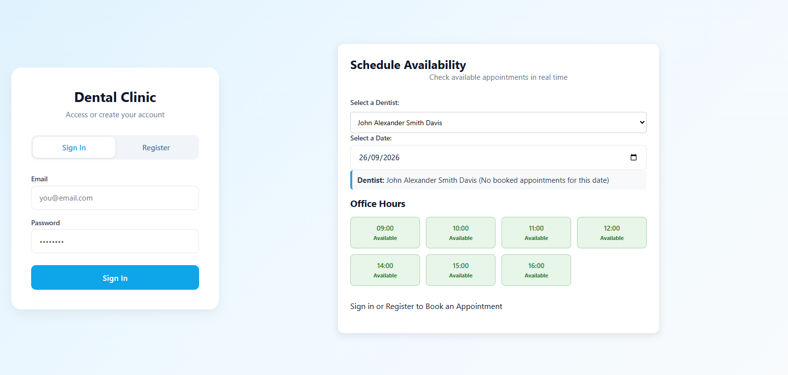

*We must sign in or register to be able to book an appointment*

*If we try to register with incorrect information, the api will cath it and the front end will show the api messages*

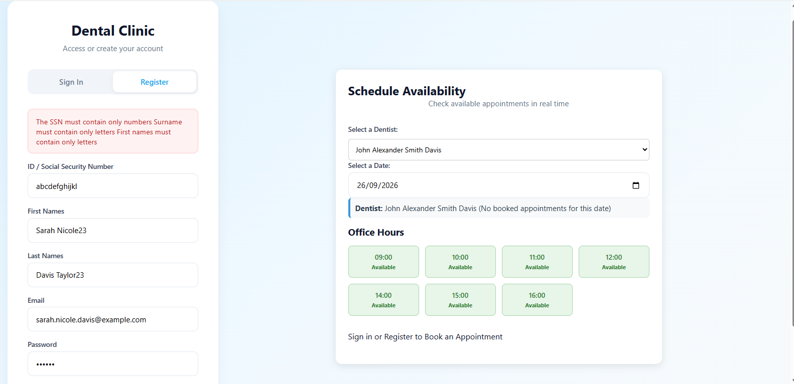

*If its correct we can register and sign in*

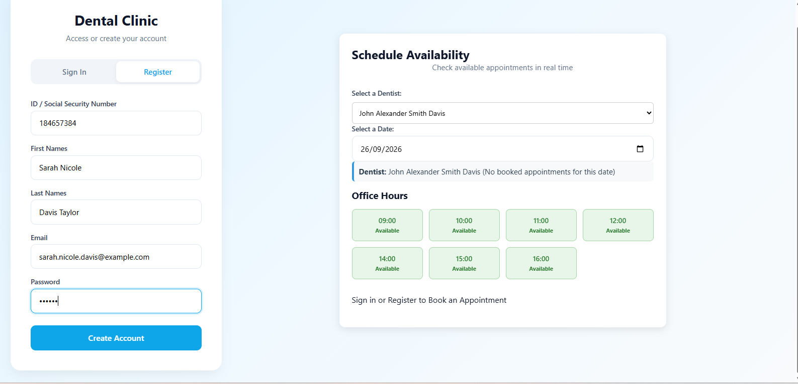
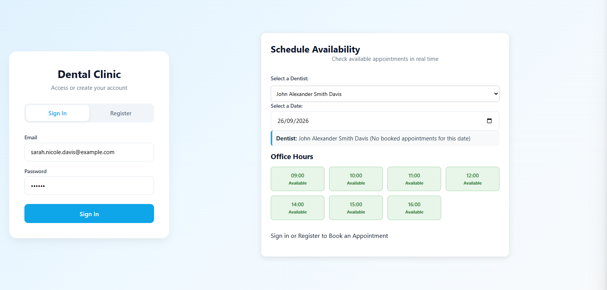
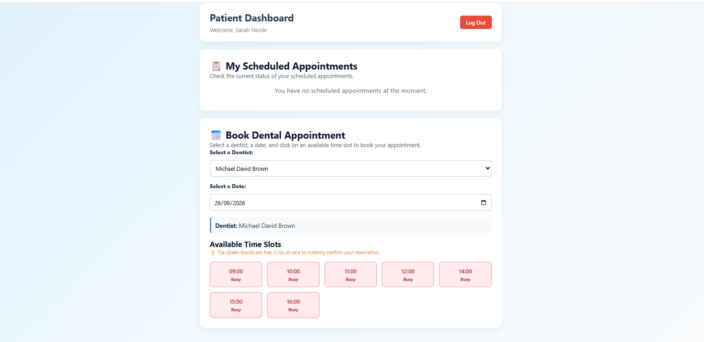

*We can now book an appointment just by clicking the slot*

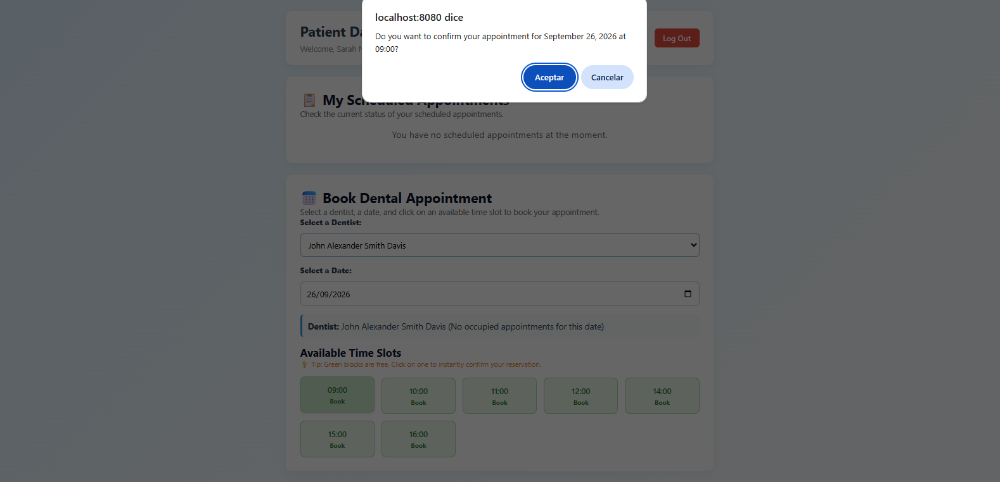

*The API always books the appointments with PENDING status, only doctors/dentists and admins can change it*

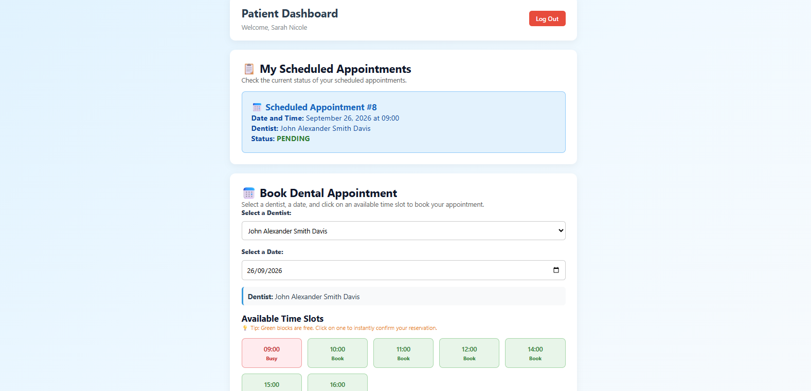

*The appointment was booked; now it automatically updates the schedule slots for all users and the Logged out preview*

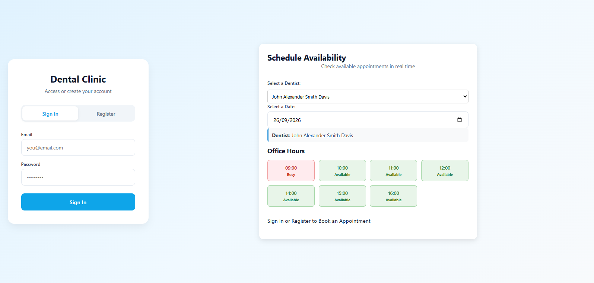

*The API will show the list of appointments that we have booked when we sign in.*

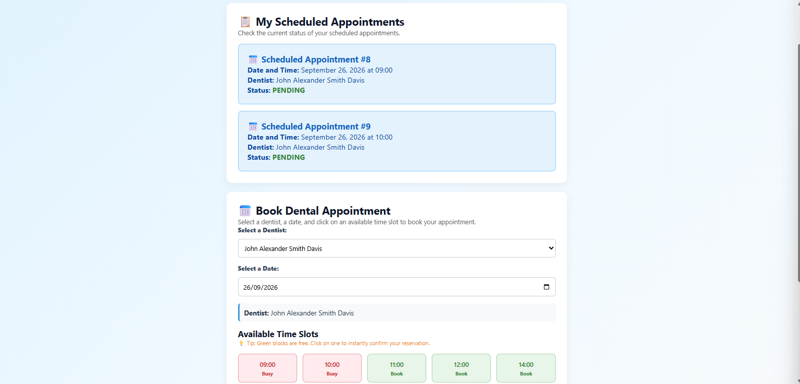

# Dentist Dashboard
*Currently we have 5 accounts/users in our database:*

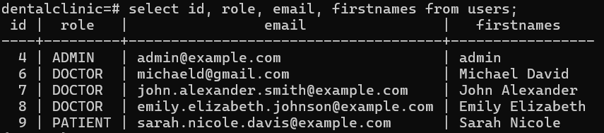

*If we sign in with a Dentist Account:*
*The API allows us to see ONLY our Patients detailed information like their ssn and their email*
*The api also allows doctors to change ONLY their appointments status.*

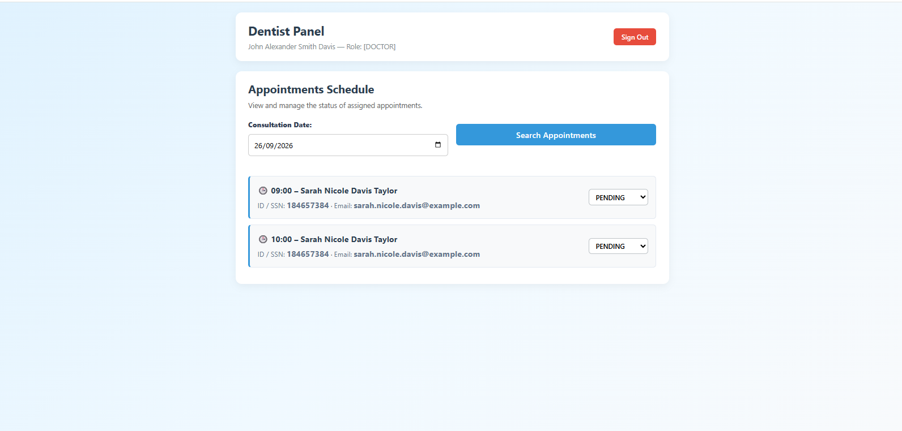
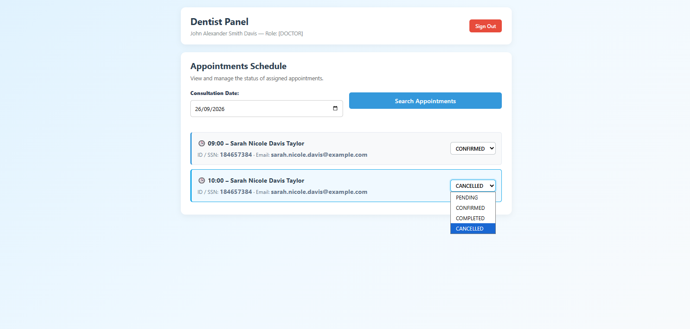
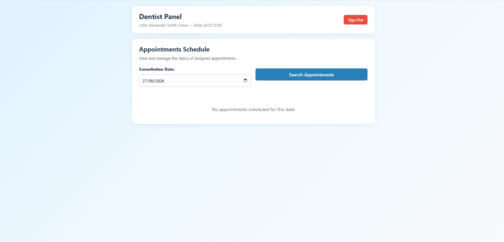

# Admin Dashboard
*If our httpsession id is not a Doctor or a patient but Admin*
*The API reads our cookies and allows us to view ANY Doctor's appointments and update ANY status*

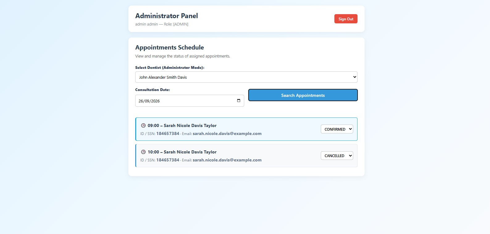
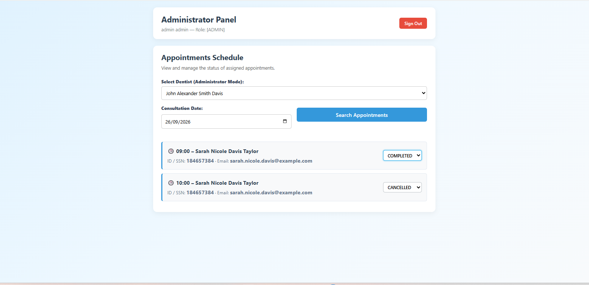